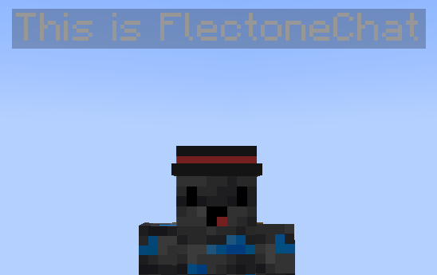

# chat-bubble

The chat-bubble module is responsible for the messages above the player's head



## Module customization

| Parameter    | Description                                            | Type     | Default   |
| ------------ | ------------------------------------------------------ | -------- | --------- |
| color        | color of the message overhead                          | `string` | `#999999` |
| max-per-line | Maximum number of characters per line                  | `number` | `35`      |
| height       | Height of the message above player head                | `number` | `1`       |
| read-speed   | read-speed, which determines the length of the message | `number` | `800`     |
  
Message duration formula
```java
duration = (messageLength + 8 * BubblesCount) * 1200 / readSpeed;
```
