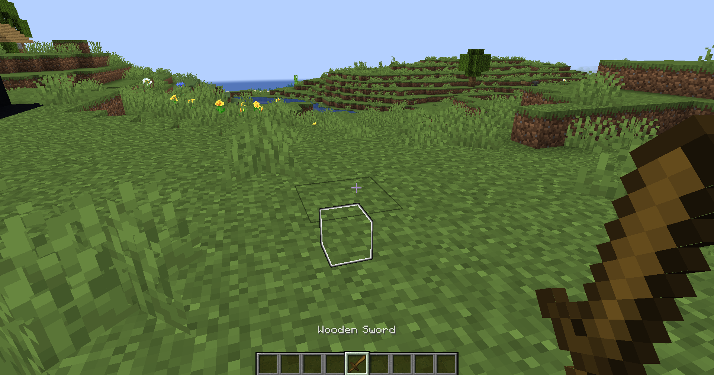

# mark
`extra.mark`

The mark module is responsible for creating temporary marks

To create a mark, you need to take the item that is specified in `config.yml`, and press RMB

:::info Important
The color of the label depends on [item name](#color). If the name is not a color, it will default to white
:::

## Colors
| Parameter    | Color                                |
| ------------ | ------------------------------------ |
| BLACK        | ■ |
| DARK_BLUE    | ■ |
| DARK_GREEN   | ■ |
| DARK_AQUA    | ■ |
| DARK_RED     | ■ |
| DARK_PURPLE  | ■ |
| GOLD         | ■ |
| GRAY         | ■ |
| DARK_GRAY    | ■ |
| BLUE         | ■ |
| GREEN        | ■ |
| AQUA         | ■ |
| RED          | ■ |
| LIGHT_PURPLE | ■ |
| YELLOW       | ■ |
| WHITE        | ■ |

## Module customization

| Parameter | Description                            | Type     | Default        |
| --------- | -------------------------------------- | -------- | -------------- |
| Item      | Item that can create marks             | `string` | `WOODEN_SWORD` |
| range     | distance at which a mark can be placed | `number` | `30`           |