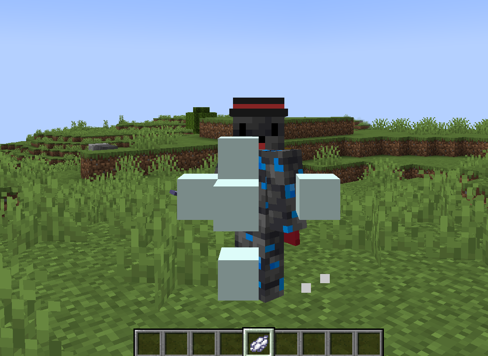

# spit
`extra.spit`

The spit module is responsible for spitting

To spit, you need to grab the item specified in `config.yml` and press RMB



## Message customization
You can change the text of the spit hit in the localization file
```yaml
commands:
  spit:
    message: "&&1🫐 You were spit on by &&2<player>"
```

## Module customization

| Parameter | Description                   | Type     | Default   |
| --------- | ----------------------------- | -------- | --------- |
| item      | item that can be used to spit | `string` | WHITE_DYE |