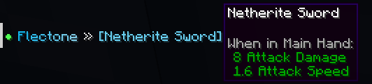
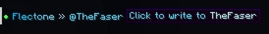
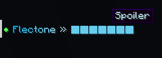

# formatting
`player-message.formatting`

The formatting module is responsible for formatting and placeholders in chat.

::: details ping
`player-message.formatting.ping`\
Placeholder `%ping%` - ping of the player

```yaml
        ping:
#          ↓ ping level
          bad: 
            color: "#ff4e4e" # color
            count: 200
#                   ↑ minimal ping (ms)
          medium: 
            color: "#fce303"
            count: 100
          good:
            color: "#4eff52"
```


:::

::: details cords
`player-message.formatting.cords`\
Placeholder `%cords%` - coordinates of the player


:::

::: details stats
`player-message.formatting.stats`\
Placeholder `%stats%` - basic statistics of the player


:::

::: details url
`player-message.formatting.url`\
Link formatting

```yaml
        url:
          hover:
            # Enable hover message 
            enable: true
            
          # Make the link clickable
          clickable: true
          # Customize custom link finding
          trigger: ((https?|ftp|gopher|telnet|file):((//)|(\\))+[\w:#@%/;$()~_?+-=\\.&]*)
          # Formatting for the link
          format: "&&1<message>"
```


:::

::: details item
`player-message.formatting.item`\
Placeholder `%item%` - item in hand


:::

::: details mention
`player-message.formatting.mention`\
Mention in chat

```yaml
        mention:
          trigger: "@" # symbol for mentions
          format: "&&1@<message>" # mention format

```


:::

::: details markdown-||
`player-message.formatting.markdown-||`\
`||spoiler||`

```yaml
        markdown-||:
          symbol: "&&1█" # symbol for spoilers
```


:::

::: details markdown-**
`player-message.formatting.markdown-`\
`**bold**`

:::

::: details markdown-##
`player-message.formatting.markdown-##`\
`__italic__`

:::

::: details markdown-__
`player-message.formatting.markdown-__`\
`__underlined__`

:::

::: details markdown-??
`player-message.formatting.markdown-??`\

`??obfuscated??`

:::

::: details markdown-~~
`player-message.formatting.markdown-~~`\
`##strikethrough##`

:::