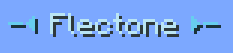

# right-click
`player.right-click`

The right-click module is responsible for displaying the nickname when clicking on a player

::: info Important
This module is independent of the `player.name-tag.visible` module
:::

## Module customization

| Parameter | Description                       | Type     | Default                   |
| --------- | --------------------------------- | -------- | ------------------------- |
| format    | formatting the displayed nickname | `string` | `&&1-⏴ &&2<player> &&1⏵-` |
