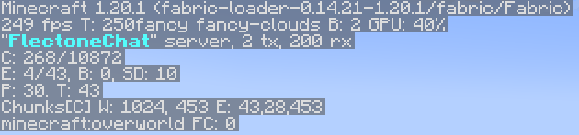

# brand
`sever.brand`

The brand module is responsible for the text shown on the debugging screen (F3)\


## Customizing messages

You can change the text in the localization file by changing/adding a line in `server.brand.message`

::: warning Warning
Messages do not support HEX colors, only [regular minecraft colors](https://minecraft.tools/ru/color-code.php)
:::

```yaml
server:
  brand:
    message:
      - "&bFlectoneChat"
```

## Animated messages

You can animate text in F3 by adding additional lines to `server.brand.message` (localization file), additionally configuring the module itself

```yaml{5}
server:
  brand:
    message:
      - "&bFlectoneChat" # First animation frame
      - "&fFlectoneChat" # Second animation frame
```

## Module customization

### `server.brand.update`
| Parameter | Description                            | Type      | Default |
| --------- | -------------------------------------- | --------- | ------- |
| enable    | Enable message update (for animations) | `boolean` | `true`  |
| rate      | rate of frame rate (in ticks)          | `number`  | `800`   |
