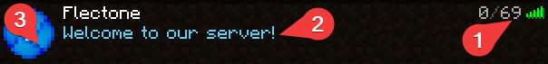

# status
`server.status`

The status module configures the server information in the server list.

[[toc]]

## player-count
Maximum number of players in the server list (visual only).

| Parameter | Description          | Type     | Default |
| --------- | -------------------- | -------- | ------- |
| number    | quantity (-1 to ...) | `number` | `69`    |

## motd

Server description in the list of servers.\
Messages are configured in the localization file

## icon

Server icon in the server list.

| Parameter | Description                                                                                                                                     | Type                    | Default                          |
| --------- | ----------------------------------------------------------------------------------------------------------------------------------------------- | ----------------------- | -------------------------------- |
| mode      | Icon display mode. When `random` the icon will be selected randomly from the list, when `single` the first element of the list will be selected | `string{random/single}` | `random`                         |
| names     | The names of icon files located in the `/plugins/flectonechat/icons/` directory.                                                                | `string[]`              | `[server-icon-1, server-icon-2]` |