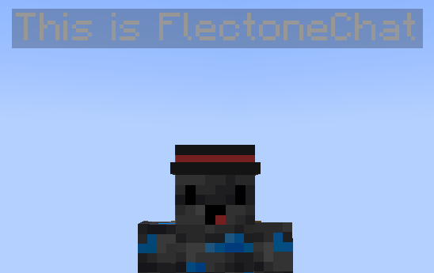

# chat-bubble

Модуль chat-bubble отвечает за сообщения над головой игрока



## Настройка модуля

| Параметр     | Описание                                                   | Тип      | Значение по умолчанию |
| ------------ | ---------------------------------------------------------- | -------- | --------------------- |
| color        | Цвет сообщения над головой                                 | `string` | `#999999`             |
| max-per-line | Максимальное кол-во символов в строке                      | `number` | `35`                  |
| height       | Высота сообщения над головой игрока                        | `number` | `1`                   |
| read-speed   | Скорость чтения, от которой зависит длительность сообщения | `number` | `800`                 |
  
Формула длительности сообщения
```java
duration = (messageLength + 8 * BubblesCount) * 1200 / readSpeed;
```