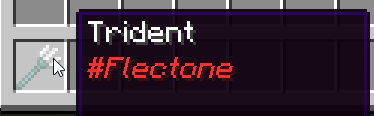

# item-sign
`extra.item-sign`

Модуль item-sign отвечает за подписывание вещей с помощью красителя

Чтобы подписать предмет нужно взять в левую руку любой краситель и нажать ЛКМ по блоку, который указан в `config.yml`

::: info Важно
На одном предмете игрок может иметь только одну свою подпись. Если предмет будет переподписан, то будет использоваться модуль [unsign](./unsign/)
:::

## Настройка модуля

| Параметр | Описание                                      | Тип      | Значение по умолчанию |
|----------|-----------------------------------------------|----------|-----------------------|
| format   | Форматирование подписи                        | `string` | `<dye>&o#<player>`    |
| block    | Блок с помощью которого подписывается предмет | `string` | `ANVIL`               |