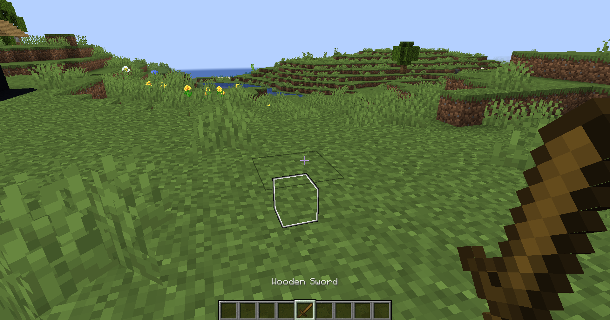

# mark
`extra.mark`

Модуль mark отвечает за создание временных меток

Чтобы создать метку, нужно взять предмет, который указан в `config.yml`, и нажать ПКМ

:::info Важно
Цвет метки зависит от [названия предмета](#цвета). Если название не цвет, то будет по умолчанию белый
:::

## Цвета
| Параметр     | Цвет                                 |
|--------------|--------------------------------------|
| BLACK        | ■ |
| DARK_BLUE    | ■ |
| DARK_GREEN   | ■ |
| DARK_AQUA    | ■ |
| DARK_RED     | ■ |
| DARK_PURPLE  | ■ |
| GOLD         | ■ |
| GRAY         | ■ |
| DARK_GRAY    | ■ |
| BLUE         | ■ |
| GREEN        | ■ |
| AQUA         | ■ |
| RED          | ■ |
| LIGHT_PURPLE | ■ |
| YELLOW       | ■ |
| WHITE        | ■ |

## Настройка модуля

| Параметр | Описание                                       | Тип      | Значение по умолчанию |
|----------|------------------------------------------------|----------|-----------------------|
| item     | Предмет с помощью которого можно ставить метки | `string` | `WOODEN_SWORD`        |
| range    | Расстояние на котором возможно ставить метку   | `number` | `30`                  |