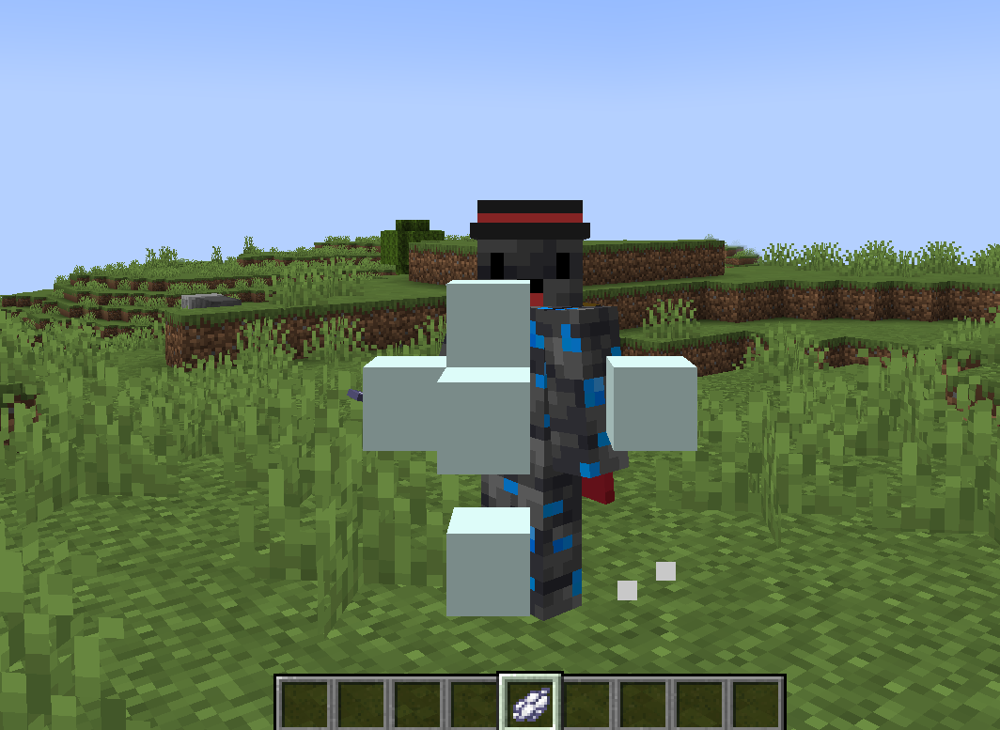

# spit
`extra.spit`

Модуль spit отвечает за плевки

Чтобы плюнуть, нужно взять предмет, который указан в `config.yml` и нажать ПКМ



## Настройка сообщения
Изменить текст попадания плевка можно в файле локализации
```yaml
commands:
  spit:
    message: "&&1🫐 Тебя оплевал игрок &&2<player>"
```

## Настройка модуля

| Параметр | Описание                                   | Тип      | Значение по умолчанию |
|----------|--------------------------------------------|----------|-----------------------|
| item     | Предмет с помощью которого можно плеваться | `string` | `WHITE_DYE`           |