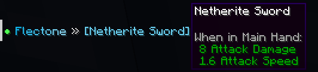
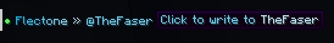
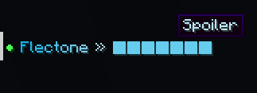

# formatting
`player-message.formatting`

Модуль formatting отвечает за форматирование и плэйсхолдеры в чате.

::: details ping
`player-message.formatting.ping`\
Плейсхолдер `%ping%` - пинг игрока

```yaml
        ping:
#          ↓ уровень пинга
          bad: 
            color: "#ff4e4e" # цвет
            count: 200
#                   ↑ минимальный уровень пинга (ms)
          medium: 
            color: "#fce303"
            count: 100
          good:
            color: "#4eff52"
```


:::

::: details cords
`player-message.formatting.cords`\
Плейсхолдер `%cords%` - координаты игрока


:::

::: details stats
`player-message.formatting.stats`\
Плейсхолдер `%stats%` - основная статистика игрока


:::

::: details url
`player-message.formatting.url`\
Форматирование ссылок

```yaml
        url:
          hover:
            # Включить сообщение при наведении 
            enable: true
            
          # Сделать, чтобы ссылка нажималась
          clickable: true
          # Настроить кастомное нахождение ссылок
          trigger: ((https?|ftp|gopher|telnet|file):((//)|(\\))+[\w:#@%/;$()~_?+-=\\.&]*)
          # Форматирование для ссылки
          format: "&&1<message>"
```


:::

::: details item
`player-message.formatting.item`\
Плейсхолдер `%item%` - предмет в руке


:::

::: details mention
`player-message.formatting.mention`\
Упоминание в чате

```yaml
        mention:
          trigger: "@" # Символ для упоминания
          format: "&&1@<message>" # Формат упоминания

```


:::

::: details markdown-||
`player-message.formatting.markdown-||`\
`||Спойлер||`

```yaml
        markdown-||:
          symbol: "&&1█" # Символ для спойлеров
```


:::

::: details markdown-**
`player-message.formatting.markdown-`\
`**Жирный текст**`

:::

::: details markdown-##
`player-message.formatting.markdown-##`\
`__курсивный текст__`

:::

::: details markdown-__
`player-message.formatting.markdown-__`\
`__подчёркнутый текст__`

:::

::: details markdown-??
`player-message.formatting.markdown-??`\

`??случайные символы??`

:::

::: details markdown-~~
`player-message.formatting.markdown-~~`\
`##зачёркнутый текст##`

:::