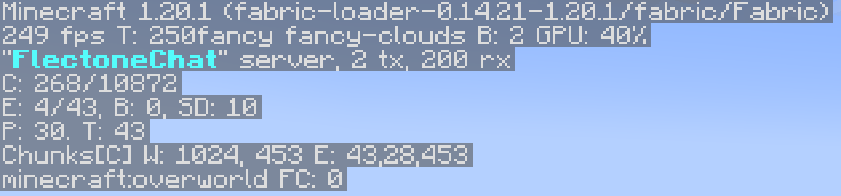

# brand
`sever.brand`

Модуль brand отвечает за текст, показываемый на экране отладки (F3)\


## Настройка сообщений

Изменить текст можно в файле локализации, изменив/добавив строчку в `server.brand.message`

::: warning Предупреждение
Сообщения не поддерживают HEX цвета, только [обычные цвета майнкрафта](https://minecraft.tools/ru/color-code.php)
:::

```yaml
server:
  brand:
    message:
      - "&bFlectoneChat"
```

## Анимированные сообщения

Анимировать текст в F3 можно добавив дополнительные строчки в `server.brand.message` (файл локализации), дополнительно настроив сам модуль

```yaml{5}
server:
  brand:
    message:
      - "&bFlectoneChat" #Первый кадр анимации
      - "&fFlectoneChat" #Второй кадр анимации
```

## Настройка модуля

### `server.brand.update`
| Параметр | Описание                                     | Тип       | Значение по умолчанию |
| -------- | -------------------------------------------- | --------- | --------------------- |
| enable   | Включить обновление сообщения (для анимаций) | `boolean` | `true`                |
| rate     | Скорость изменения кадров (в тиках)          | `number`  | `800`                 |
