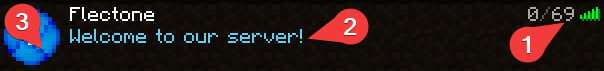

# status
`server.status`

Модуль status настраивает информацию о сервере в списке серверов.

[[toc]]

## player-count
Максимальное кол-во игроков в списке серверов (только визуально).

::: tip Важно
Если количество игроков превышает лимит, игрок не будет допущен и отобразится сообщение server.status.player-count.server-full.
Разрешение на обход server.status.player-count.bypass
:::

| Параметр | Описание                  | Тип      | Значение по умолчанию |
| -------- | ------------------------- | -------- | --------------------- |
| number   | Количество (от -1 до ...) | `number` | `69`                  |

## motd

Описание сервера в списке серверов.\
Сообщения настраиваются в файле локализации

## icon

Иконка сервера в списке серверов.

| Параметр | Описание                                                                                                                           | Тип                     | Значение по умолчанию            |
| -------- | ---------------------------------------------------------------------------------------------------------------------------------- | ----------------------- | -------------------------------- |
| mode     | Режим отображения иконки. При `random` иконка будут выбираться случайно из списка, при `single` будет выбран первый элемент списка | `string{random/single}` | `random`                         |
| names    | Названия файлов с иконками, находящиеся в директории `/plugins/flectonechat/icons/`                                                | `string[]`              | `[server-icon-1, server-icon-2]` |